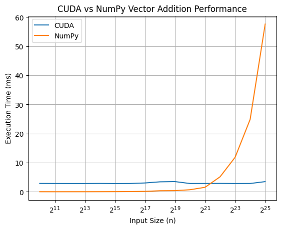

# Day 1: CUDA vs NumPy Vector Addition Performance

## Overview
Today, I kicked off my 100-day CUDA challenge by diving into a simple yet insightful comparison: CUDA vs NumPy for vector addition. The goal was to see how a custom CUDA kernel stacks up against NumPy's built-in vector addition, especially on Google Colab's free T4 GPU.

## What I Did
- **Implemented a CUDA Kernel:**  
  I wrote a basic CUDA kernel for vector addition (`vector_add.cu`) and ran it on Google Colab. The kernel adds two arrays element-wise, and I timed its performance.
- **Compared with NumPy:**  
  Used NumPy's vector addition (`a + b`), as implemented in `vector_add.ipynb`, as a baseline and timed it as well.
- **Scaled Up the Input:**  
  Initially, I set `n = 2^20` (1 million elements) and noticed something interesting—NumPy was faster than my CUDA kernel! To dig deeper, I increased `n` from `2^10` to `2^25` (powers of 2) and plotted the results.

## Key Takeaways
- **NumPy is Fast for Small Data:**  
  For smaller datasets, NumPy's highly optimized C backend outperformed my CUDA kernel. This makes sense since NumPy is designed for efficiency on CPUs, and the overhead of launching a CUDA kernel isn't justified for small tasks.
- **CUDA Shines for Large Data:**  
  As `n` increased, the CUDA kernel started to outperform NumPy. The graph below shows that CUDA's execution time grows much slower than NumPy's as the input size scales up—demonstrating the power of CUDA's parallel processing.
- **Crossover Point:**  
  There's a sweet spot where CUDA becomes more efficient than NumPy. For the T4 GPU on Colab, this seems to occur around `n = 2^20` to `n = 2^22`.

## Graph: CUDA vs NumPy Execution Time

## Thoughts and Next Steps
This was a fun start! It's fascinating to see how CUDA can handle large datasets more efficiently, while still highlighting the importance of choosing the right tool for the job. For smaller tasks, NumPy remains highly effective.

For tomorrow, I plan to tweak the CUDA kernel to explore potential optimizations and perhaps venture into more complex operations. Let's see how far we can push this!
