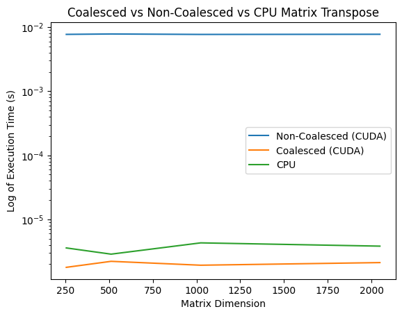

# Day 2: Matrix Transpose (Coalesced vs Non-Coalesced vs CPU)

## Overview
Today, I explored matrix transposition using CUDA kernels and compared their performance to a CPU implementation (using NumPy). Specifically, I tested two GPU kernels:
1. **Non-Coalesced Kernel**: Each thread reads and writes data without optimizing for coalesced memory access.
2. **Coalesced Kernel**: Uses a tile-based approach and shared memory to ensure coalesced reads and writes.

I also compared both kernels against a straightforward CPU implementation of matrix transposition (e.g., NumPy or a standard C++ loop).

## What I Did
- **Created a CUDA Source File**  
  Wrote a `.cu` file (`matrix_transpose.cu`) containing two kernels:
  - **Non-Coalesced**: A direct read/write with no shared memory optimization.
  - **Coalesced**: A shared memory tile-based transpose to improve memory access patterns.
- **Compiled and Ran the Kernels**  
  Used `nvcc` on Google Colab’s T4 GPU to compile and measure execution times.
- **Scaled Matrix Sizes**  
  Tested square matrices of varying dimensions (e.g., 256, 512, 1024, 2048) to observe how performance scales.
- **Compared to CPU (NumPy)**  
  Implemented a simple transpose in Python/NumPy as a baseline.

## Results
The figure below shows the log of execution time (y-axis) against matrix dimension (x-axis). The GPU coalesced approach consistently outperforms both the non-coalesced kernel and the CPU approach as the matrix size increases.

### Observations
1. **Coalesced vs Non-Coalesced (CUDA)**
   - The coalesced kernel achieves better memory throughput, especially at larger dimensions, resulting in lower execution times.
   - The non-coalesced kernel suffers from unaligned memory accesses, which slow down performance.

2. **GPU vs CPU**
   - For smaller matrices, the CPU implementation can be competitive, since GPU overhead (kernel launch, data transfer) might not be fully amortized.
   - As matrix size grows, the GPU-based methods (particularly coalesced) gain a significant advantage.

## Key Takeaways
- **Shared Memory + Coalesced Access** is essential for high performance in CUDA when dealing with matrix operations.
- **GPU Overhead Matters**: For small problems, a CPU or even a naive GPU implementation might suffice, but for large matrices, optimizing for memory access on the GPU can yield substantial speedups.
- **Performance Tuning**: Adjusting tile sizes and block dimensions can further optimize results.

## Next Steps
- Explore **bank conflict avoidance** and **further tiling strategies** to see if performance can be improved even more.
- Investigate **asynchronous data transfers** (streams) to overlap computation and data movement.
- Compare **float vs double** performance to see how precision affects speed and memory throughput.

**Thanks for reading, and stay tuned for Day 3 of the 100-day CUDA challenge!**
